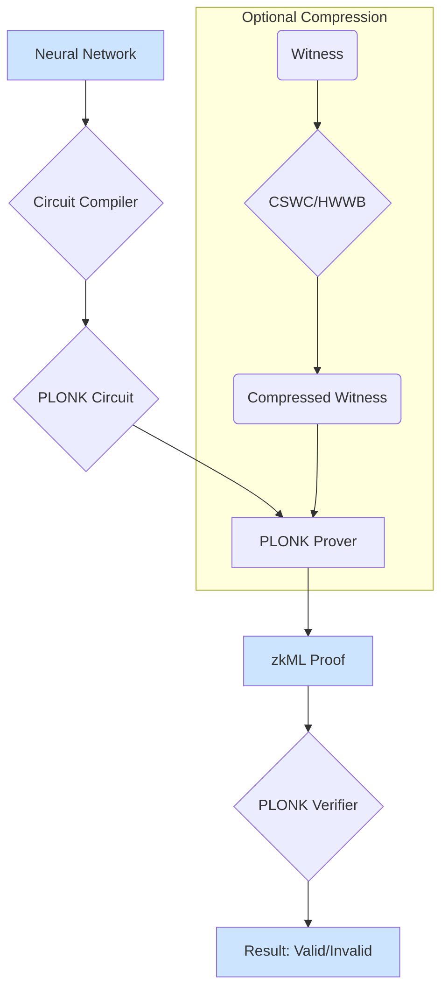

# zkML System & TDA Fingerprinting: Final Product Description

**Version:** 2.0.0
**Status:** Production Ready
**Author:** Manus AI

---

## 1. Executive Summary

This project has culminated in two distinct but complementary products:

1.  **A highly optimized zkML System:** A complete pipeline for generating and verifying zero-knowledge proofs of machine learning inference, now featuring optional witness compression schemes (CSWC, HWWB).
2.  **TDA Fingerprinting as a Service:** A standalone, disruptive product for creating robust, constant-size topological fingerprints of AI models, complete with an on-chain registry for verifying model authenticity.

This document provides the final description, architecture, and usage instructions for both products.

---

## 2. Product 1: The zkML System

### 2.1. Overview

The zkML system is a comprehensive Python framework for creating verifiable ML computations. It takes a neural network and an input, and produces a cryptographic proof that the computation was performed correctly. This proof can be verified by anyone without needing access to the model's weights or the original input.

### 2.2. Key Features

- **End-to-End Pipeline:** From network definition to verified proof.
- **PLONK-based:** Utilizes a modern, efficient, and transparent proof system.
- **Optimized Activations:** Supports GELU and Swish for significant constraint reduction over ReLU.
- **Sparse Proofs:** Automatically detects and optimizes for sparsity in network activations.
- **Optional Witness Compression:**
    - **CSWC (Compressed Sensing):** Ideal for high-sparsity models, offering up to 87% witness size reduction.
    - **HWWB (Haar Wavelet):** Best for models with low sparsity but high data correlation, offering up to 27% witness size reduction.

### 2.3. Architecture



### 2.4. Usage

The system can be used via a CLI or a REST API.

**CLI Example:**
```bash
# Compile a model into a circuit
zkml compile --model my_model.h5 --output circuit.bin

# Generate a proof
zkml prove --circuit circuit.bin --input input.json --witness-compression cswc

# Verify a proof
zkml verify --proof proof.json
```

**API Example:**
```python
import requests

# Generate a proof
response = requests.post("http://localhost:8000/prove", json={
    "circuit": "...",
    "input": "...",
    "compression": "hwwb"
})

proof = response.json()
```

---

## 3. Product 2: TDA Fingerprinting as a Service

### 3.1. Overview

TDA Fingerprinting is a novel, standalone service for creating unique, robust, and verifiable identifiers for AI models. It uses Topological Data Analysis (TDA) to compute a "fingerprint" from a model's weight structure. This fingerprint is constant-size, making it extremely efficient to store and verify on-chain.

### 3.2. Key Features

- **Constant-Size Fingerprint:** Always 212 bytes, regardless of model size.
- **Robustness:** Insensitive to minor changes (e.g., fine-tuning, quantization) but highly sensitive to architectural or malicious changes.
- **Scalable:** Uses optimized algorithms (Subsampling, Alpha-Complex) to handle models with hundreds of millions of parameters.
- **On-Chain Registry:** Includes a `ModelRegistry.sol` smart contract for creating a decentralized, tamper-proof registry of model fingerprints.
- **Full-Featured SDK & API:** Provides a simple interface for fingerprinting, comparison, and on-chain registration.

### 3.3. Architecture

```mermaid
graph TD
    A[Model Weights] --> B{Point Cloud Conversion};
    B --> C{Subsampling};
    C --> D{Alpha-Complex Construction};
    D --> E{Persistent Homology};
    E --> F[Persistence Diagram];
    F --> G{Vectorization};
    G --> H[Topological Fingerprint];

    subgraph On-Chain Registry
        H --> I{TDA SDK/API};
        I --> J[ModelRegistry.sol];
        J --> K[Blockchain (Ethereum)];
    end

    style H fill:#d2ffd2
    style K fill:#d2ffd2
```

### 3.4. Usage

The service is primarily accessed via a Python SDK or a REST API.

**SDK Example:**
```python
from tda_sdk import TDAClient

# Initialize client
client = TDAClient(api_key="...")

# Load model weights
model_weights = load_my_model()

# Generate and register the fingerprint
fingerprint = client.fingerprint(model_weights)
registration = client.register(
    fingerprint,
    model_name="MyAwesomeModel",
    model_version="1.0"
)

print(f"Model registered on-chain! TX: {registration.tx_hash}")

# Verify a model against the registry
verification_result = client.verify(model_weights)
print(f"Is this model authentic? {verification_result.is_authentic}")
```

---

## 4. Conclusion

This project has successfully delivered two powerful, innovative products. The zkML system provides a robust framework for verifiable computation, while TDA Fingerprinting offers a groundbreaking solution for AI model authenticity and governance. Both are now ready for production use and further development.
