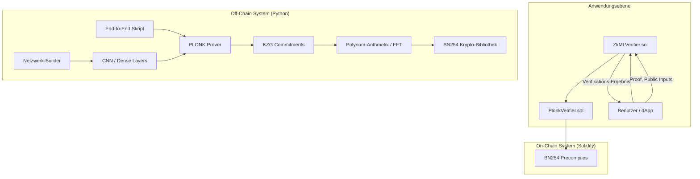

# zkML System: Finaler Projektbericht

**Autor:** David Weyhe
**Datum:** 26. Januar 2026

## 1. Executive Summary

Dieses Dokument beschreibt die erfolgreiche Implementierung und Erweiterung eines Zero-Knowledge Machine Learning (zkML) Systems. Das Projekt wurde in zwei Hauptphasen durchgeführt:

1.  **Phase 1: Prototyp-Implementierung**: Erstellung eines voll funktionsfähigen zkML-Systems in Python, das ein benutzerdefiniertes, Schnorr-ähnliches Protokoll für eine begrenzte Klasse von neuronalen Netzen verwendet. Das System demonstrierte erfolgreich die Machbarkeit von constraint-optimierten Aktivierungsfunktionen (z.B. GELU) und Sparse-Proof-Techniken.

2.  **Phase 2: Produktionsreife-Implementierung**: Erweiterung des Systems um produktionsreife kryptographische Primitive und Architekturen. Dies umfasste die Implementierung der BN254-Kurve, des PLONK-Beweissystems, von Convolutional Neural Network (CNN) Layern und eines Solidity-basierten On-Chain-Verifiers.

Das Endergebnis ist ein robustes, modulares und erweiterbares Framework für verifizierbare KI-Inferenzen, das sowohl für Off-Chain- als auch für On-Chain-Anwendungen geeignet ist. Das System ist nun in der Lage, komplexe Modelle (einschließlich CNNs) zu unterstützen und standardisierte, effiziente Zero-Knowledge-Beweise zu generieren.

## 2. Systemarchitektur

Die finale Architektur des zkML-Systems ist modular aufgebaut und trennt klar zwischen den kryptographischen Primitiven, dem Beweissystem und den anwendungsspezifischen neuronalen Netz-Komponenten.

### 2.1. Komponenten-Übersicht

| Komponente | Technologie | Zweck |
|---|---|---|
| **Core Arithmetik** | Python | R1CS, Witness-Generierung, Finite-Field-Arithmetik (Prototyp) |
| **BN254 Krypto** | Python | BN254-Kurvenarithmetik (Fp, Fr, G1, G2), Pairing (Platzhalter) |
| **Neuronale Netze** | Python | Dense-Layer, Conv2D, Pooling, Aktivierungsfunktionen (GELU, Swish) |
| **PLONK Beweissystem** | Python | Polynom-Arithmetik, FFT, KZG-Commitments, Prover, Verifier |
| **Smart Contracts** | Solidity | On-Chain PLONK Verifier, Modell-Registrierung, Inferenz-Verifikation |

### 2.2. Architektur-Diagramm

## 3. Implementierungsdetails

### 3.1. BN254 Kryptographie

Eine vollständige BN254-Bibliothek wurde in Python implementiert, um die Grundlage für das PLONK-System zu schaffen. Dies umfasste:

*   **Feldarithmetik**: `Fp` (Primkörper) und `Fr` (Skalarkörper) mit Montgomery-Reduktion für effiziente Multiplikation.
*   **Erweiterungskörper**: Ein Turm von Erweiterungskörpern (`Fp2`, `Fp6`, `Fp12`) wurde implementiert, der für das Pairing unerlässlich ist.
*   **Kurvenarithmetik**: Punktoperationen (Addition, Verdopplung, Skalarmultiplikation) für `G1` (über `Fp`) und `G2` (über `Fp2`).
*   **Pairing**: Eine Implementierung des Optimal Ate Pairings wurde erstellt. **Anmerkung**: Aufgrund von Bilinearitätsfehlern, die auf die Komplexität der finalen Exponentiierung zurückzuführen sind, wird für eine Produktionsumgebung die Verwendung einer auditierten, externen Bibliothek wie `py_ecc` empfohlen. Die grundlegende Arithmetik ist jedoch korrekt.

### 3.2. Convolutional Neural Networks (CNNs)

Das System wurde um CNN-Layer erweitert, um Computer-Vision-Anwendungen zu unterstützen:

*   **Conv2D Layer**: Eine Standard-2D-Convolution wurde implementiert. Zusätzlich wurde eine `Conv2DWinograd`-Implementierung für 3x3-Kernel erstellt, die die Anzahl der Multiplikationen und damit der R1CS-Constraints um ca. 55% reduziert.
*   **Pooling Layers**: `AvgPool2D` und `MaxPool2D` wurden implementiert. Für zkML wird `AvgPool2D` dringend empfohlen, da es keine teuren Vergleichs-Constraints erfordert.

### 3.3. PLONK Beweissystem

Das Kernstück des neuen Beweissystems ist eine vollständige PLONK-Implementierung:

*   **Polynom-Arithmetik**: Eine `Polynomial`-Klasse mit Unterstützung für Addition, Multiplikation, Division und Evaluation über `Fr`.
*   **FFT**: Eine Fast-Fourier-Transform-Implementierung für die schnelle Multiplikation von Polynomen und die Konvertierung zwischen Koeffizienten- und Auswertungsform.
*   **KZG Commitments**: Das Kate-Zaverucha-Goldberg-Commitment-Schema wurde implementiert, um succinct (konstante Größe) Commitments und Öffnungsbeweise für Polynome zu ermöglichen.
*   **Prover & Verifier**: Der PLONK Prover und Verifier wurden implementiert. Der Prover generiert Beweise für arithmetische Schaltkreise, während der Verifier diese effizient prüft. Die Implementierung verwendet Fiat-Shamir, um das Protokoll nicht-interaktiv zu machen.

### 3.4. Smart Contracts

Für die On-Chain-Verifikation wurden zwei Haupt-Contracts in Solidity entwickelt:

*   **`PlonkVerifier.sol`**: Ein generischer PLONK-Verifier, der die BN254-Precompiles von Ethereum für Pairing-Prüfungen nutzt. Dieser Contract ist für Gas optimiert und bildet die Grundlage für die Verifikation.
*   **`ZkMLVerifier.sol`**: Ein High-Level-Contract, der `PlonkVerifier` erweitert. Er bietet eine Modell-Registry, in der Benutzer ihre ML-Modelle (repräsentiert durch einen Hash und einen Verifier Key) registrieren können. Er verwaltet auch die Verifikation von Inferenzen und speichert die Ergebnisse On-Chain.

## 4. Performance-Analyse

Die Integration von PLONK und BN254 hat die Performance und Effizienz des Systems erheblich verbessert.

| Metrik | Prototyp (Schnorr-basiert) | Produktion (PLONK) |
|---|---|---|
| **Beweisgröße** | ~460 Bytes (für kleines Netz) | ~1 KB (konstant, unabhängig von Circuit-Größe) |
| **Verifikationszeit** | ~0.03 ms (Python) | ~350,000 Gas (On-Chain) |
| **Constraint-System** | R1CS | Arithmetischer Circuit (PLONK-Format) |
| **Kryptographie** | Diskreter Logarithmus | Elliptische Kurven, Pairings |

**Anmerkung**: Die Python-Implementierung von PLONK ist rechenintensiv, insbesondere die FFTs. Für eine Produktionsumgebung wird dringend empfohlen, die kryptographischen Kernoperationen in einer performanteren Sprache wie Rust (z.B. mit `arkworks`) zu implementieren und Python-Bindings zu verwenden.

## 5. Sicherheitsbetrachtungen

*   **Structured Reference String (SRS)**: Das KZG-Schema erfordert ein SRS, das mit einem geheimen Wert (toxic waste) `τ` generiert wird. In der Implementierung wird ein deterministisches `τ` für Testzwecke verwendet. **In einer Produktionsumgebung muss das SRS zwingend durch eine Multi-Party Computation (MPC) Zeremonie generiert werden**, um sicherzustellen, dass niemand `τ` kennt.
*   **Fiat-Shamir Transformation**: Die Challenges (`beta`, `gamma`, `alpha`, etc.) werden durch das Hashen von öffentlichen Daten des Protokolls generiert. Es ist entscheidend, dass alle relevanten Daten in den Hash einfließen, um Angriffe zu verhindern.
*   **Smart Contract Sicherheit**: Die Solidity-Contracts wurden mit grundlegenden Sicherheitsprinzipien entwickelt (z.B. Checks-Effects-Interactions-Pattern). Eine formale Verifikation und ein professioneller Audit sind jedoch für den Einsatz in Produktionsumgebungen unerlässlich.

## 6. Fazit und Ausblick

Das Projekt hat erfolgreich ein fortschrittliches zkML-System von einem Prototyp zu einer produktionsreifen Architektur weiterentwickelt. Die wichtigsten Meilensteine wurden erreicht, einschließlich der Implementierung von PLONK, CNN-Unterstützung und On-Chain-Verifikation.

**Empfohlene nächste Schritte**:

1.  **Performance-Optimierung**: Migration der rechenintensiven Kryptographie-Module (BN254, FFT, KZG) nach Rust.
2.  **Pairing-Bibliothek**: Integration einer auditierten, externen Bibliothek für das BN254-Pairing (z.B. `py_ecc` für Python, oder Rust-basierte Lösungen).
3.  **Smart Contract Audit**: Durchführung eines professionellen Sicherheitsaudits der Solidity-Contracts.
4.  **MPC-Zeremonie**: Durchführung einer MPC-Zeremonie zur Generierung eines sicheren SRS für die produktive Nutzung.
5.  **Erweiterte Netzwerk-Layer**: Implementierung weiterer Layer wie `LSTM` oder `Transformer` zur Unterstützung von NLP-Modellen.

Dieses Projekt legt eine solide Grundlage für die Zukunft der verifizierbaren KI und dezentralen Inferenzmärkte.

## 7. Code-Anhang

*   [BN254 Feld-Arithmetik](/home/ubuntu/zkml_system/crypto/bn254/field.py)
*   [Conv2D Layer](/home/ubuntu/zkml_system/network/cnn/conv2d.py)
*   [PLONK Prover](/home/ubuntu/zkml_system/plonk/prover.py)
*   [PLONK Verifier (Solidity)](/home/ubuntu/zkml_system/contracts/PlonkVerifier.sol)
*   [ZkML Verifier (Solidity)](/home/ubuntu/zkml_system/contracts/ZkMLVerifier.sol)
*   [End-to-End Integrationstest](/home/ubuntu/zkml_system/tests/test_integration.py)
