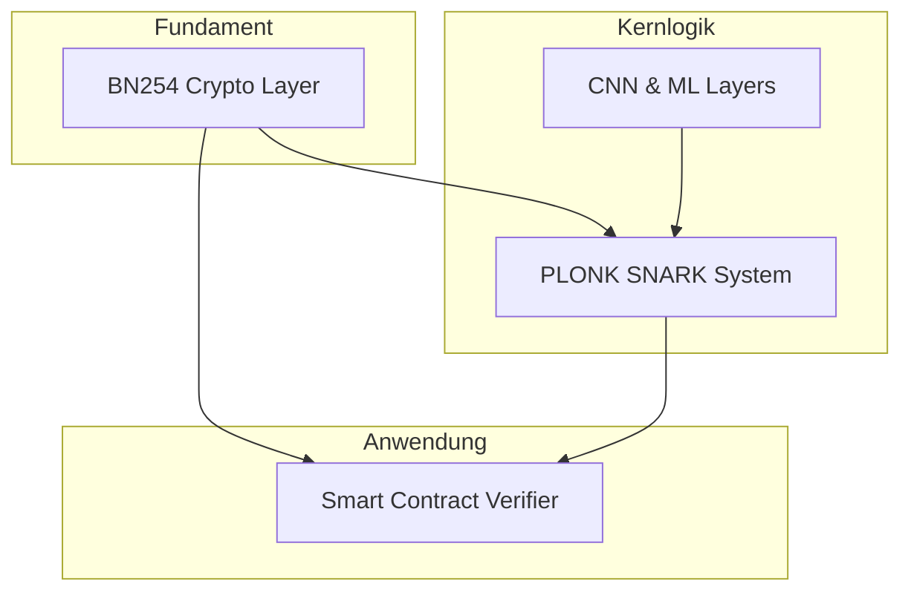
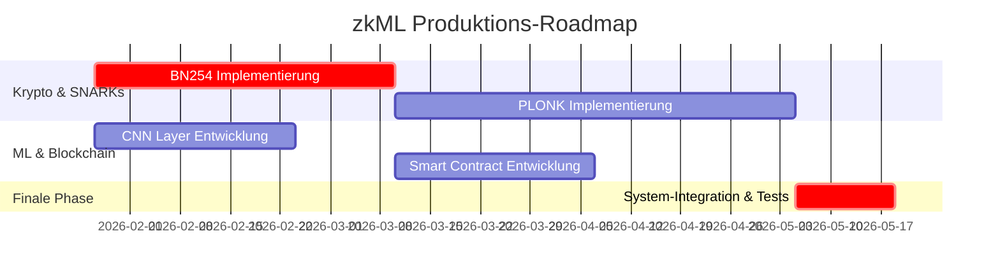

# zkML-System: Architektur für Produktionsreife

**Systemarchitekt: Manus AI**

**Datum: 26. Januar 2026**

---

## Agenda

1.  **Ausgangslage**: Der aktuelle Proof-of-Concept
2.  **Vision**: Produktionsreifes, dezentrales zkML
3.  **Die 4 Säulen der Architektur**
    -   BN254-Kryptographie
    -   PLONK SNARK-System
    -   CNN-Unterstützung
    -   On-Chain-Verifikation
4.  **Roadmap & Zeitplan**
5.  **Ressourcen & Risiken**

---

## 1. Ausgangslage: Proof-of-Concept

-   **Funktionalität**: Verifikation von einfachen Dense-Netzwerken.
-   **Proof-System**: Vereinfachtes Schnorr-Protokoll (nicht Zero-Knowledge).
-   **Kryptographie**: Kleines Primfeld (`p=101`), unsicher.
-   **Verifikation**: Nur offline möglich.

**Fazit**: Ein valider Prototyp, aber meilenweit von einem produktiven Einsatz entfernt.

---

## 2. Vision: Produktionsreifes, dezentrales zkML

Ein System, das es jedem ermöglicht, die Inferenz eines Machine-Learning-Modells **trustless** und **privat** auf einer öffentlichen Blockchain zu verifizieren.

-   **Sicher**: 128-Bit kryptographische Sicherheit.
-   **Privat**: Echte Zero-Knowledge-Garantien.
-   **Fähig**: Unterstützt Standard-Computer-Vision-Modelle (CNNs).
-   **Dezentral**: Verifizierbar durch einen Smart Contract auf Ethereum.

---

## 3. Die 4 Säulen der Architektur

---

## Säule 1: BN254-Kryptographie

-   **Problem**: Das aktuelle Primfeld ist unsicher und nicht kompatibel.
-   **Lösung**: Umstellung auf die **BN254**-Kurve.
    -   **128-Bit Sicherheit**.
    -   **Ethereum-kompatibel** durch Nutzung der Precompiles.
    -   **Performant** durch optimierte Feld- und Kurvenarithmetik (Montgomery, NAF, etc.).
-   **Dauer**: 6 Wochen

---

## Säule 2: PLONK SNARK-System

-   **Problem**: Das aktuelle Proof-System ist nicht Zero-Knowledge.
-   **Lösung**: Implementierung von **PLONK**.
    -   **Universeller Trusted Setup**: Einmaliges Setup für alle Circuits.
    -   **Hohe Flexibilität** für komplexe Circuits (wie CNNs).
    -   **Gute Performance** und wachsende Unterstützung im Ethereum-Ökosystem.
-   **Dauer**: 8 Wochen

---

## Säule 3: CNN-Unterstützung

-   **Problem**: Nur Dense-Layer werden unterstützt.
-   **Lösung**: Implementierung von **CNN-Layern** mit Fokus auf Constraint-Optimierung.
    -   `Conv2D` mit Winograd-Optimierung.
    -   `AvgPool` statt teurem `MaxPool`.
    -   `Fused BatchNorm` zur Eliminierung von Constraints.
-   **Ziel**: Lauffähige, zk-optimierte Modelle wie **LeNet-5**.
-   **Dauer**: 4 Wochen

---

## Säule 4: On-Chain-Verifikation

-   **Problem**: Verifikation ist nur offline möglich.
-   **Lösung**: Entwicklung eines **gas-effizienten Solidity-Verifiers**.
    -   Nutzung der **BN254-Precompiles** auf Ethereum.
    -   Modulare Architektur: `Verifier`, `Registry`, `PairingLib`.
    -   **Geschätzte Gaskosten**: ~230k Gas pro Verifikation.
-   **Dauer**: 4 Wochen

---

## 4. Roadmap & Zeitplan

**Gesamtdauer: 16 Wochen**

---

## 5. Ressourcen & Risiken

-   **Team**: 3 spezialisierte Ingenieure (Krypto, ML, Solidity).
-   **Hauptrisiken**:
    -   **PLONK-Komplexität**: Kann durch Nutzung externer Bibliotheken gemindert werden.
    -   **Gas-Kosten**: Können durch L2-Rollups und weitere Optimierungen adressiert werden.
    -   **Sicherheitslücken**: Erfordern ein externes Audit vor dem Mainnet-Deployment.

---

## Nächste Schritte

1.  **Team-Zusammenstellung**.
2.  **Beginn der BN254- und CNN-Entwicklung** (parallel).
3.  **Implementierung von PLONK und Smart Contracts**.
4.  **Integration und rigorose Tests**.
5.  **Externes Sicherheitsaudit**.
6.  **Mainnet-Deployment**.

**Fragen?**
