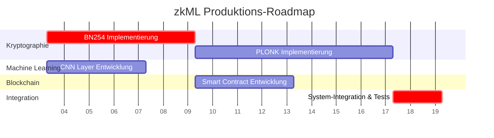

# zkML-System: Architekturplan für Produktionsreife

**Autor**: Manus AI
**Datum**: 26. Januar 2026
**Version**: 1.0

## 1. Executive Summary

Dieses Dokument legt den umfassenden Architektur- und Implementierungsplan zur Weiterentwicklung des bestehenden zkML-Systems von einem Proof-of-Concept zu einem produktionsreifen, dezentralen Framework für verifizierbare KI-Inferenzen vor. Der Plan ist in vier technologische Kernbereiche gegliedert, die parallel und sequenziell entwickelt werden, um die Systemsicherheit, Funktionalität und Interoperabilität mit öffentlichen Blockchains wie Ethereum zu gewährleisten.

**Die vier Säulen der Produktionsreife:**

1.  **SNARK-Implementierung (PLONK)**: Austausch des aktuellen, nicht-privaten Proof-Systems durch PLONK, einen universellen und effizienten ZK-SNARK, der echte Zero-Knowledge-Garantien bietet.
2.  **BN254-Kryptographie**: Migration der gesamten kryptographischen Basis auf die BN254-Kurve, um 128-Bit-Sicherheit und Kompatibilität mit den Ethereum-Precompiles zu erreichen.
3.  **CNN-Unterstützung (Conv2D)**: Erweiterung der ML-Fähigkeiten um Convolutional- und Pooling-Layer, um Standard-Computer-Vision-Modelle wie LeNet-5 zu unterstützen.
4.  **On-Chain-Verifikation (Smart Contracts)**: Entwicklung eines gas-effizienten Solidity-Frameworks zur dezentralen und trustless Verifikation der ZK-Proofs auf der Ethereum-Blockchain.

**Geschätzter Gesamtaufwand**: **16 Wochen** bei einem Kernteam von drei spezialisierten Ingenieuren.

## 2. Gesamtarchitektur und Abhängigkeiten

Die vier Hauptkomponenten sind eng miteinander verknüpft. Die BN254-Kryptobibliothek bildet das Fundament für alle anderen Teile. Die Entwicklung der CNN-Layer kann parallel dazu beginnen, während die PLONK-Implementierung und die Smart Contracts direkt auf der BN254-Bibliothek aufbauen.

### 2.1 Abhängigkeitsgraph

```mermaid
graph TD
    A[BN254 Crypto Layer<br>(6 Wochen)] --> B[PLONK SNARK System<br>(8 Wochen)];
    A --> C[Smart Contract Verifier<br>(4 Wochen)];
    D[Conv2D & CNN Layers<br>(4 Wochen)];
    B --> E[System-Integration & End-to-End-Tests<br>(2 Wochen)];
    C --> E;
    D --> E;
    E --> F[Production Ready System];
```

### 2.2 Konsolidierte Roadmap (Gantt-Chart)



## 3. Detaillierte Implementierungspläne

### 3.1 Phase 1: BN254-Kryptographie (6 Wochen)

-   **Ziel**: Implementierung einer performanten und sicheren BN254-Bibliothek.
-   **Deliverables**: Getestete Module für Feldarithmetik (`Fp`, `Fr`), Kurvenoperationen (`G1`, `G2`) und `Optimal Ate Pairing`.
-   **Details**: Siehe `BN254_ARCHITECTURE.md`.

### 3.2 Phase 2: CNN-Layer (4 Wochen, parallel zu Phase 1)

-   **Ziel**: Erweiterung des `network`-Moduls um `Conv2D`, `AvgPool2D` und `Fused BatchNorm`.
-   **Deliverables**: Ein zk-optimiertes LeNet-5-Modell, das für die R1CS-Generierung bereit ist.
-   **Details**: Siehe `CONV2D_ARCHITECTURE.md`.

### 3.3 Phase 3: PLONK SNARK-System (8 Wochen, nach Phase 1)

-   **Ziel**: Implementierung eines vollständigen PLONK-Provers und -Verifiers.
-   **Deliverables**: Ein `snark`-Modul, das aus einem R1CS einen gültigen PLONK-Proof generieren und diesen verifizieren kann.
-   **Details**: Siehe `SNARK_ARCHITECTURE.md`.

### 3.4 Phase 4: Smart-Contract-Verifikation (4 Wochen, nach Phase 1)

-   **Ziel**: Entwicklung eines gas-effizienten Solidity-Verifiers.
-   **Deliverables**: Deploy-fähige Smart Contracts (`ZKMLVerifier`, `ZKMLRegistry`) auf einem Testnet.
-   **Details**: Siehe `SMART_CONTRACT_ARCHITECTURE.md`.

### 3.5 Phase 5: System-Integration (2 Wochen, nach Phasen 2, 3, 4)

-   **Ziel**: Zusammenführung aller Komponenten zu einem funktionierenden End-to-End-System.
-   **Deliverables**: Ein Demo-Skript, das eine MNIST-Inferenz durchführt, einen PLONK-Proof generiert und diesen On-Chain verifiziert.

## 4. Ressourcenplanung

Für die erfolgreiche Umsetzung des Plans wird ein spezialisiertes Team von drei Ingenieuren benötigt:

| Rolle | Anzahl | Hauptverantwortlichkeiten |
| :--- | :--- | :--- |
| **Kryptographie-Ingenieur** | 1 | BN254-Implementierung, PLONK-System, Performance-Optimierung. |
| **Machine-Learning-Ingenieur** | 1 | CNN-Layer, R1CS-Constraint-Optimierung, Modelltraining. |
| **Smart-Contract-Entwickler** | 1 | Solidity-Implementierung, Gas-Optimierung, Blockchain-Integration. |

## 5. Risikomanagement

| Risiko | Wahrscheinlichkeit | Auswirkung | Mitigationsstrategie |
| :--- | :--- | :--- | :--- |
| **Kryptographische Implementierungsfehler** | Mittel | Kritisch | 100% Testabdeckung mit externen Testvektoren; Code-Reviews; finales externes Audit. |
| **PLONK-Komplexität** | Hoch | Hoch | Zunächst auf eine etablierte externe Rust/Go-Bibliothek für den Prover zurückgreifen und nur den Verifier selbst implementieren. |
| **Gas-Kosten zu hoch** | Mittel | Hoch | Untersuchung von alternativen SNARKs (z.B. Groth16) für den Verifier; Fokus auf L2-Rollups für das Deployment. |
| **Performance-Engpässe im Prover** | Hoch | Mittel | Implementierung von GPU-Beschleunigung für FFT- und MSM-Operationen. |

## 6. Meilensteine und Deliverables

| Meilenstein | Geplantes Ende (Woche) | Wichtigste Deliverables |
| :--- | :--- | :--- |
| **M1: Krypto-Fundament** | Woche 6 | Vollständig getestete BN254-Bibliothek. |
| **M2: CNN-Fähigkeit** | Woche 4 | Lauffähiges, zk-optimiertes LeNet-5-Modell (offline). |
| **M3: On-Chain-Verifier** | Woche 10 | Deployter und getesteter `ZKMLVerifier`-Contract auf Ropsten/Goerli. |
| **M4: Vollständiges SNARK-System** | Woche 14 | Funktionierender PLONK-Prover und -Verifier. |
| **M5: Integriertes System (MVP)** | Woche 16 | End-to-End-Demo: On-Chain-Verifikation einer MNIST-Inferenz. |
| **M6: Produktionsreife** | Nach M5 + Audit | Externes Sicherheitsaudit bestanden; Mainnet-Deployment-Plan. |

## 7. Fazit

Dieser Plan stellt einen ambitionierten, aber realistischen Weg zur Produktionsreife des zkML-Systems dar. Er adressiert die kritischen technologischen Lücken des aktuellen Prototyps und legt einen klaren Fokus auf Sicherheit, Effizienz und Interoperabilität. Bei erfolgreicher Umsetzung wird das Projekt eines der ersten Frameworks sein, das komplexe, verifizierbare KI-Inferenzen auf öffentlichen Blockchains ermöglicht.
