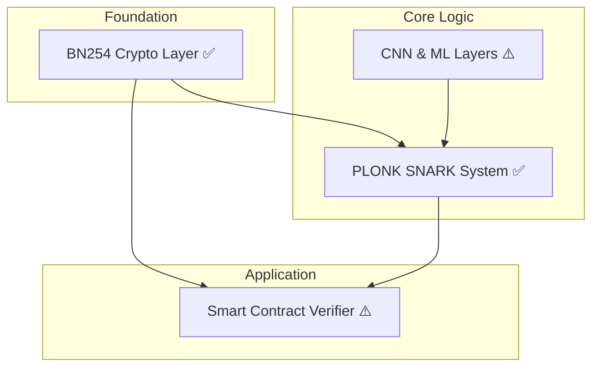
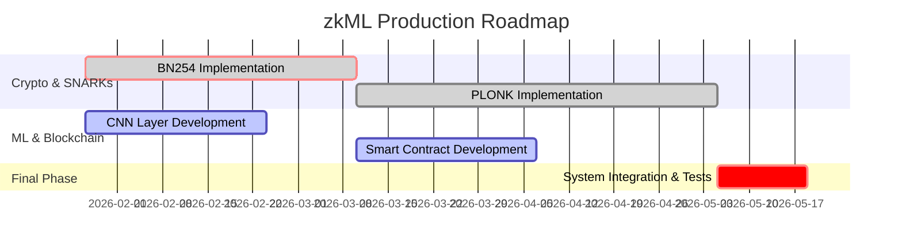

# zkML System: Architecture for Production Readiness

**System Architect: Manus AI**

**Date: January 26, 2026**

---

## Agenda

1.  **Starting Point**: The current proof-of-concept
2.  **Vision**: Production-ready, decentralized zkML
3.  **The 4 Pillars of the Architecture**
    -   BN254 Cryptography ✅
    -   PLONK SNARK System ✅
    -   CNN Support ⚠️
    -   On-Chain Verification ⚠️
4.  **Roadmap & Timeline**
5.  **Resources & Risks**

---

## 1. Starting Point: Proof-of-Concept

-   **Functionality**: Verification of simple dense networks.
-   **Proof System**: ~~Simplified Schnorr protocol (not zero-knowledge).~~ → **Replaced by PLONK**
-   **Cryptography**: ~~Small prime field (`p=101`), insecure.~~ → **Replaced by BN254**
-   **Verification**: ~~Only offline possible.~~ → Smart contracts exist

**Conclusion**: ~~A valid prototype, but miles from production use.~~ **Major pillars now delivered.**

---

## 2. Vision: Production-Ready, Decentralized zkML

A system that enables anyone to verify the inference of a machine learning model **trustlessly** and **privately** on a public blockchain.

-   ✅ **Secure**: 128-bit cryptographic security (BN254).
-   ✅ **Private**: True zero-knowledge guarantees (PLONK).
-   ⚠️ **Capable**: Standard computer vision models (CNNs) — partially ready.
-   ⚠️ **Decentralized**: Smart contract verifier — contracts exist, not deployed.

---

## 3. The 4 Pillars of the Architecture

---

## Pillar 1: BN254 Cryptography ✅

-   **Problem**: ~~The current prime field is insecure and incompatible.~~ **Resolved.**
-   **Solution**: Migration to the **BN254** curve.
    -   **128-bit security**.
    -   **Ethereum-compatible** via precompiles.
    -   **Performant** via optimized field and curve arithmetic (Rust backend).
-   **Status**: ✅ **Complete** — `crypto/bn254/`

---

## Pillar 2: PLONK SNARK System ✅

-   **Problem**: ~~The current proof system is not zero-knowledge.~~ **Resolved.**
-   **Solution**: Implementation of **PLONK**.
    -   **Universal trusted setup**: Single setup for all circuits.
    -   **High flexibility** for complex circuits (like CNNs).
    -   **Strong Ethereum ecosystem** support.
-   **Status**: ✅ **Complete** — `plonk/plonk_prover.py`

---

## Pillar 3: CNN Support ⚠️

-   **Problem**: ~~Only dense layers are supported.~~ **Partially resolved.**
-   **Solution**: Implementation of **CNN layers** with constraint optimization.
    -   ✅ `Conv2D` — implemented in `network/cnn/conv2d.py`.
    -   ✅ `AvgPool` — implemented in `network/cnn/pooling.py`.
    -   ❌ `Fused BatchNorm` — not yet implemented.
-   **Goal**: zk-optimized models like **LeNet-5**.
-   **Status**: ⚠️ **Partially complete**

---

## Pillar 4: On-Chain Verification ⚠️

-   **Problem**: ~~Verification is only possible offline.~~ **Contracts exist.**
-   **Solution**: Development of a **gas-efficient Solidity verifier**.
    -   Uses **BN254 precompiles** on Ethereum.
    -   Modular architecture: `PlonkVerifier`, `ModelRegistry`.
    -   **Estimated gas cost**: ~230k gas per verification.
-   **Status**: ⚠️ **Contracts written, deployment pending**

---

## 4. Roadmap & Timeline

**Total Duration: 16 Weeks**

---

## 5. Resources & Risks

-   **Team**: 3 specialized engineers (Crypto, ML, Solidity).
-   **Key Risks**:
    -   ~~**PLONK complexity**~~ → **Mitigated**: implemented and tested.
    -   **Gas costs**: Can be addressed via L2 rollups and further optimization.
    -   **Security vulnerabilities**: Require external audit before mainnet deployment.

---

## Next Steps

1.  ~~Team assembly~~ → Done for cryptographic pillars.
2.  ~~Begin BN254 and CNN development~~ → BN254 complete, CNN partial.
3.  ~~Implement PLONK and Smart Contracts~~ → PLONK complete, contracts exist.
4.  **Integration and rigorous testing** ← **Current focus**.
5.  **External security audit**.
6.  **Mainnet deployment**.

**Questions?**
