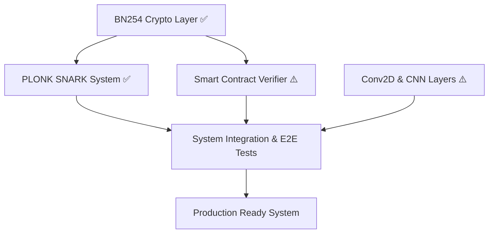

# zkML System: Architecture Plan for Production Readiness

**Author**: Upsalla
**Date**: January 26, 2026
**Version**: 1.0
**Status**: **PARTIALLY DELIVERED** — see milestone status below.

## 1. Executive Summary

This document presents the comprehensive architecture and implementation plan for advancing the zkML system from a proof-of-concept to a production-ready, decentralized framework for verifiable AI inferences. The plan is structured around four core technology areas.

**The Four Pillars of Production Readiness**:

1. ✅ **SNARK Implementation (PLONK)**: Replacement of the non-private proof system with PLONK. → **Implemented** (`plonk/plonk_prover.py`)
2. ✅ **BN254 Cryptography**: Migration to BN254 curve for 128-bit security. → **Implemented** (`crypto/bn254/`)
3. ⚠️ **CNN Support (Conv2D)**: Extension with convolutional and pooling layers. → **Partially implemented** (`network/cnn/`)
4. ⚠️ **On-Chain Verification (Smart Contracts)**: Gas-efficient Solidity framework. → **Contracts exist** (`contracts/`), not deployed

## 2. Architecture and Dependencies

### 2.1 Dependency Graph

## 3. Detailed Implementation Plans

### 3.1 Phase 1: BN254 Cryptography ✅

- **Status**: Fully implemented in `crypto/bn254/`.
- **Details**: See `BN254_ARCHITECTURE.md`.

### 3.2 Phase 2: CNN Layers ⚠️

- **Status**: Conv2D and Pooling implemented. BatchNorm, Flatten, LeNet-5 model pending.
- **Details**: See `CONV2D_ARCHITECTURE.md`.

### 3.3 Phase 3: PLONK SNARK System ✅

- **Status**: Prover, Verifier, KZG, SRS, Circuit Compiler all implemented.
- **Details**: See `SNARK_ARCHITECTURE.md`.

### 3.4 Phase 4: Smart Contract Verification ⚠️

- **Status**: Contracts exist (`PlonkVerifier.sol`, `ZkMLVerifier.sol`, `ModelRegistry.sol`). Not deployed or E2E tested.
- **Details**: See `SMART_CONTRACT_ARCHITECTURE.md`.

### 3.5 Phase 5: System Integration

- **Status**: `zkml_bridge.py` wires prover. `zkml.py` high-level API quarantined (hollow shell audit).

## 4. Resource Planning

| Role | Count | Primary Responsibilities |
| :--- | :--- | :--- |
| **Cryptography Engineer** | 1 | BN254 implementation, PLONK system, performance optimization. |
| **Machine Learning Engineer** | 1 | CNN layers, R1CS constraint optimization, model training. |
| **Smart Contract Developer** | 1 | Solidity implementation, gas optimization, blockchain integration. |

## 5. Milestones and Deliverables

| Milestone | Status | Key Deliverables |
| :--- | :--- | :--- |
| **M1: Crypto Foundation** | ✅ Complete | Fully tested BN254 library. |
| **M2: CNN Capability** | ⚠️ Partial | Conv2D + Pooling implemented; LeNet-5 pending. |
| **M3: On-Chain Verifier** | ⚠️ Partial | Contracts written; deployment pending. |
| **M4: Complete SNARK System** | ✅ Complete | Functioning PLONK prover and verifier. |
| **M5: Integrated System (MVP)** | ❌ Pending | End-to-end demo not yet assembled. |
| **M6: Production Readiness** | ❌ Pending | External security audit + mainnet deployment plan. |

## 6. Conclusion

This plan represents an ambitious but realistic path to production readiness. The critical cryptographic pillars (BN254 + PLONK) have been delivered. Remaining work focuses on CNN completion, smart contract deployment, and end-to-end integration testing.
